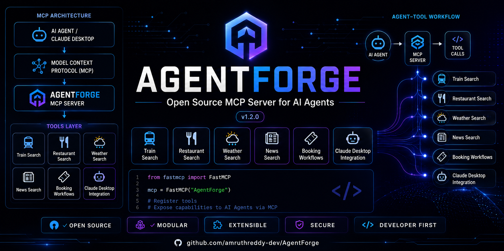
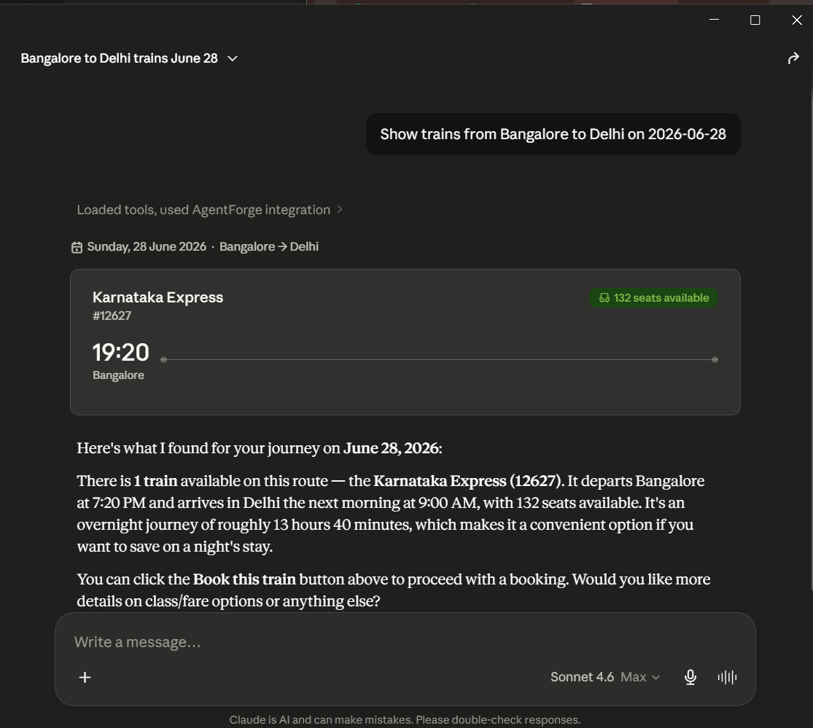
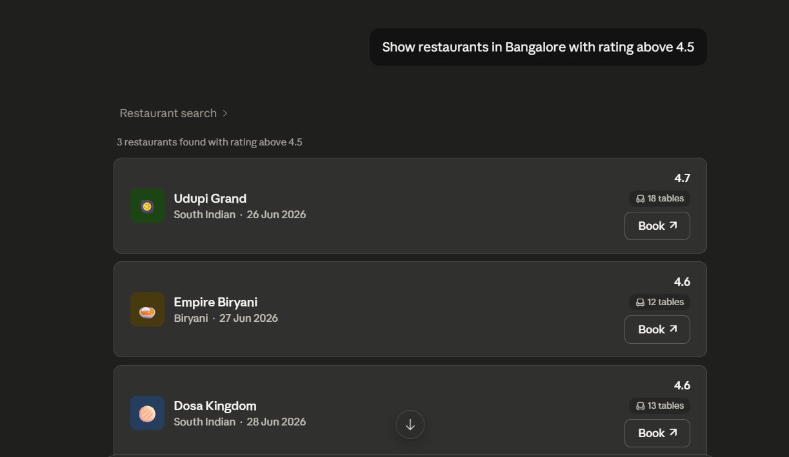
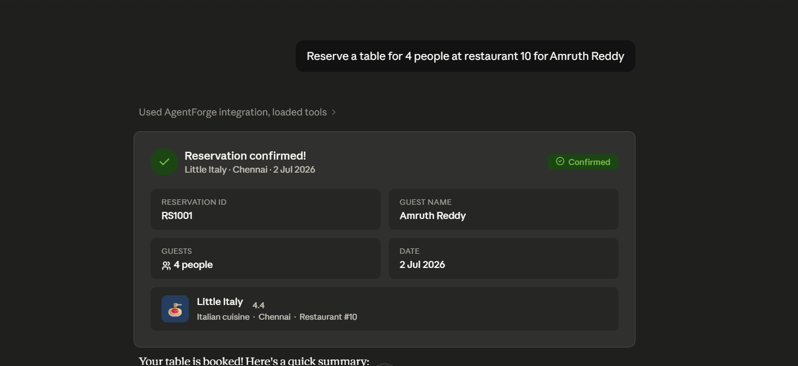
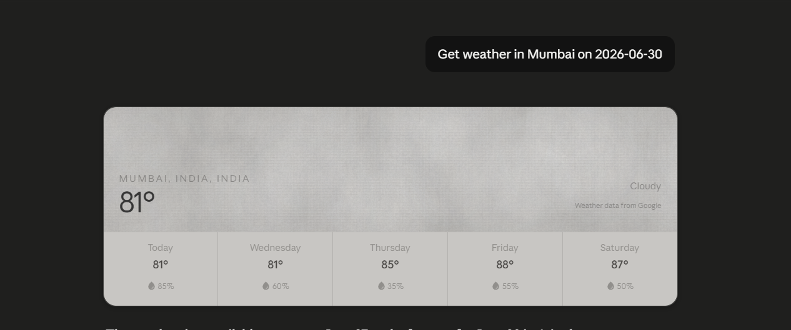
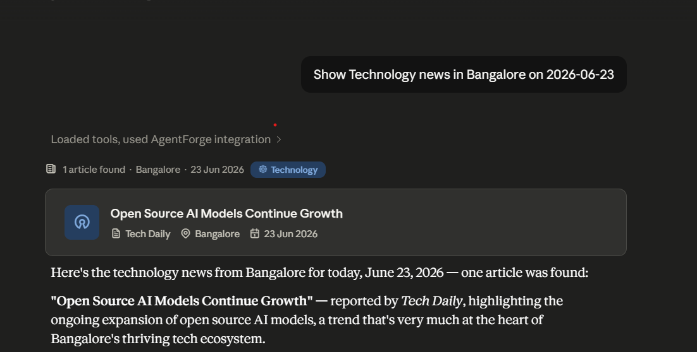

<p align="center">
  
</p>

# AgentForge 🚀

> Open Source MCP Server for AI Agents


---

## Overview

AgentForge is a modular MCP (Model Context Protocol) server built using Python and FastMCP.

It enables AI assistants such as Claude Desktop to perform structured tool calling through a production-style MCP architecture.

### Key Highlights

- MCP Architecture
- Tool Calling
- Claude Desktop Integration
- Date-Aware Search
- Booking Workflows
- Persistent Storage
- Open Source Development

---

## Features

### 🚆 Train Tools

- Search trains by source and destination
- Date-aware train search
- Train information lookup
- Seat availability checking
- Route lookup
- Train booking workflow

### 🍽 Restaurant Tools

- Search restaurants by city
- Search by cuisine
- Restaurant details lookup
- Rating lookup
- Date-aware restaurant search
- Table reservation workflow

### 🌦 Weather Tools

- Weather lookup by city
- Date-aware weather search
- Weather condition filtering

### 📰 News Tools

- Search news by category
- Search news by city
- Date-aware news retrieval

### 🎫 Booking Workflows

- Train booking
- Restaurant reservation
- Persistent JSON storage
- Booking confirmation IDs

---

## Architecture

```text
AI Agent
     │
     ▼
Model Context Protocol (MCP)
     │
     ▼
AgentForge MCP Server
     │
     ├── Train Tools
     ├── Restaurant Tools
     ├── Weather Tools
     ├── News Tools
     └── Booking Workflows
```

---

## Project Structure

```text
agentforge/
│
├── data/
│   ├── trains.json
│   ├── restaurants.json
│   ├── weather.json
│   ├── news.json
│   ├── bookings.json
│   └── reservations.json
│
├── screenshots/
│
├── tools/
│   ├── trains.py
│   ├── food.py
│   ├── weather.py
│   ├── news.py
│   ├── bookings.py
│   └── reservations.py
│
├── server.py
├── README.md
├── LICENSE
├── CHANGELOG.md
├── CONTRIBUTING.md
├── SECURITY.md
└── requirements.txt
```

---

## Screenshots

### Train Search


### Train Booking



### Restaurant Search



### Table Reservation



### Weather Search



### News Search



---

## Installation

```bash
git clone https://github.com/amruthreddy-dev/AgentForge.git

cd AgentForge

python -m venv venv

venv\Scripts\activate

pip install -r requirements.txt

python server.py
```

---

## Claude Desktop Setup

Configure Claude Desktop MCP settings to run:

```bash
python server.py
```

Restart Claude Desktop.

AgentForge tools will automatically become available.

---

## Example Prompts

```text
Show trains from Bangalore to Delhi on 2026-06-28

Book train 12627 for Amruth Reddy

Find Italian restaurants in Mumbai on 2026-07-10

Reserve a table for 4 people at restaurant 10

Get weather in Mumbai on 2026-06-30

Show Technology news in Bangalore on 2026-07-01
```

---

## Tech Stack

- Python
- FastMCP
- JSON Storage
- Claude Desktop
- MCP Protocol

---

## Roadmap

- Flight Search
- Job Search
- Stock Market Tools
- Real API Integrations
- Voice Agent Integration
- Multi-Agent Workflows
- Web Dashboard

---

## License

MIT License

---

## Author

**Amruth Reddy**

Built for learning MCP architecture, AI agents, open-source development, portfolio building, and internship applications.